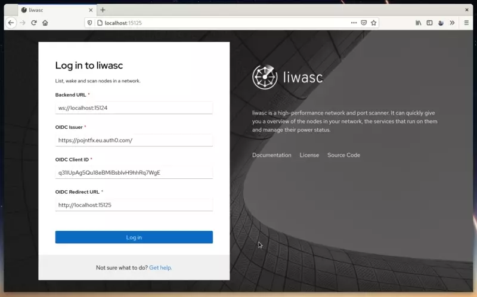
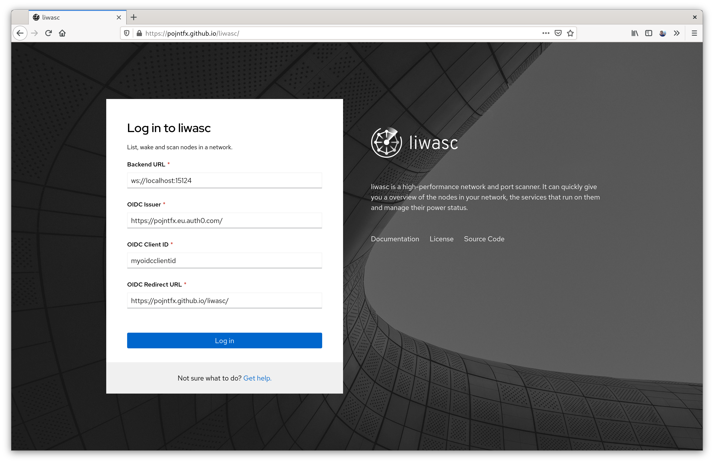
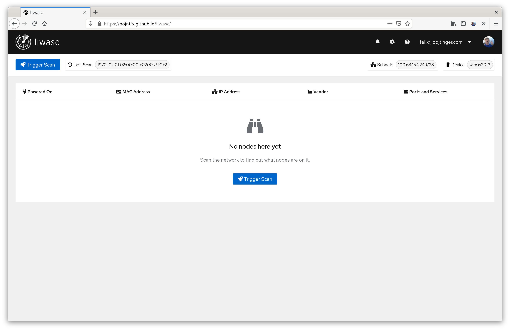

# liwasc

[](https://pojntfx.github.io/liwasc/)

List, wake and scan nodes in a network.

[](https://github.com/pojntfx/liwasc/actions/workflows/hydrun.yaml)
[](https://github.com/pojntfx/liwasc/actions/workflows/docker.yaml)
[](https://pkg.go.dev/github.com/pojntfx/liwasc)
[](https://matrix.to/#/#liwasc:matrix.org?via=matrix.org)

## Overview

liwasc is a high-performance network and port scanner. It can quickly give you a overview of the nodes in your network, the services that run on them and manage their power status.

It can ...

- **Scan a network**: Using an ARP scan and the [mac2vendor](https://mac2vendor.com/) database, liwasc can list the nodes in a network, their power status, manufacturer information, IP & MAC addresses and more metadata
- **Scan a node**: Using a high-performance custom TCP and UDP port scanner, liwasc can list the ports and services of a node and provide metadata (service names, registration dates etc.) using the [Service Name and Transport Protocol Port Number Registry](https://www.iana.org/assignments/service-names-port-numbers/service-names-port-numbers.xhtml)
- **Power on a node**: By sending [Wake-on-LAN packets](https://en.wikipedia.org/wiki/Wake-on-LAN), liwasc can turn on nodes in a network
- **Periodically scan a network**: Using the integrated periodic scans feature, liwasc can periodically (based on a CRON syntax) scan a network and persist the results in a database
- **Give remote insight into a network**: Because liwasc is based on open web technologies, has a gRPC API and supports OpenID Connect authentication, liwasc can be securely exposed to the public internet and serve as a remote controller for a network

## Installation

### Containerized

You can get the Docker container like so:

```shell
$ docker pull pojntfx/liwasc-backend
```

### Natively

If you prefer a native installation, static binaries are also available on [GitHub releases](https://github.com/pojntfx/liwasc/releases).

You can install them like so:

```shell
$ curl -L -o /tmp/liwasc-backend https://github.com/pojntfx/liwasc/releases/download/latest/liwasc-backend.linux-$(uname -m)
$ sudo install /tmp/liwasc-backend /usr/local/bin
$ sudo setcap cap_net_raw+ep /usr/local/bin/liwasc-backend # This allows rootless execution
```

### About the Frontend

The frontend is also available on [GitHub releases](https://github.com/pojntfx/liwasc/releases) in the form of a static `.tar.gz` archive; to deploy it, simply upload it to a CDN or copy it to a web server. For most users, this shouldn't be necessary though; thanks to [@maxence-charriere](https://github.com/maxence-charriere)'s [go-app package](https://go-app.dev/), liwasc is a progressive web app. By simply visiting the [public deployment](https://pojntfx.github.io/liwasc/) once, it will be available for offline use whenever you need it.

[](https://pojntfx.github.io/liwasc/)

## Usage

### 1. Setting up Authentication

liwasc uses [OpenID Connect](https://en.wikipedia.org/wiki/OpenID_Connect) for authentication, which means you can use almost any authentication provider, both self-hosted and as a service, that you want to. We've created a short tutorial video which shows how to set up [Auth0](https://auth0.com/) for this purpose, but feel free to use something like [Ory](https://github.com/ory/hydra) if you prefer a self-hosted solution:

[](https://www.youtube.com/watch?v=N3cocCOsrGw)

### 2. (Option 1): Starting the Backend (Containerized)

Using Docker (or an alternative like Podman), you can easily start & configure the backend; see the [Reference](#reference) for more configuration parameters:

```shell
$ docker run \
    --name liwasc-backend \
    -d \
    --restart always \
    --net host \
    --cap-add NET_RAW \
    --ulimit nofile=16384:16384 \
    -v ${HOME}/.local/share/liwasc:/root/.local/share/liwasc:z \
    -e LIWASC_BACKEND_OIDCISSUER=https://pojntfx.eu.auth0.com/ \
    -e LIWASC_BACKEND_OIDCCLIENTID=myoidcclientid \
    -e LIWASC_BACKEND_DEVICENAME=eth0 \
    pojntfx/liwasc-backend
```

You can get the logs like so:

```shell
$ docker logs liwasc-backend
```

### 2. (Option 2): Starting the Backend (Natively)

If you prefer a native setup, you can also do a more traditional setup.

First, set up a config file at `~/.local/share/liwasc/etc/liwasc/liwasc-backend-config.yaml`; see the [Reference](#reference) for more configuration parameters:

```shell
$ mkdir -p ~/.local/share/liwasc/etc/liwasc/
$ cat <<EOT >~/.local/share/liwasc/etc/liwasc/liwasc-backend-config.yaml
oidcIssuer: https://pojntfx.eu.auth0.com/
oidcClientID: myoidcclientid
deviceName: eth0
EOT
```

Now, create a systemd service for it:

```shell
$ mkdir -p ~/.config/systemd/user/
$ cat <<EOT >~/.config/systemd/user/liwasc-backend.service
[Unit]
Description=liwasc

[Service]
ExecStart=/usr/local/bin/liwasc-backend -c \${HOME}/.local/share/liwasc/etc/liwasc/liwasc-backend-config.yaml
LimitNOFILE=16384:16384

[Install]
WantedBy=multi-user.target
EOT
```

Finally, reload systemd and enable the service:

```shell
$ systemctl --user daemon-reload
$ systemctl --user enable --now liwasc-backend
```

You can get the logs like so:

```shell
$ journalctl --user -u liwasc-backend
```

### 3. Connecting the Frontend

Now that the backend is running, head over to [https://pojntfx.github.io/liwasc/](https://pojntfx.github.io/liwasc/):

[](https://pojntfx.github.io/liwasc/)

Alternatively, as described in [About the Frontend](#about-the-frontend), you can also choose to self-host. Once you're on the page, you should be presented with the following setup page:



You'll have to enter your own information here; the `Backend URL` is the URL on which the backend runs, the `OIDC Issuer`, `Client ID` and `Redirect URL` are the same values that you've set the backend up with above.

Finally, click on `Login`, and if everything worked out fine you should be presented with the initial launch screen:



🚀 **That's it**! We hope you enjoy using liwasc.

## Reference

### Command Line Arguments

```shell
$ liwasc-backend --help
liwasc is a high-performance network and port scanner. It can quickly give you a overview of the nodes in your network, the services that run on them and manage their power status.

For more information, please visit https://github.com/pojntfx/liwasc.

Usage:
  liwasc-backend [flags]

Flags:
  -c, --configFile string                            Config file to use
  -d, --deviceName string                            Network device name (default "eth0")
  -h, --help                                         help for liwasc-backend
  -l, --listenAddress string                         Listen address (default "localhost:15123")
      --mac2vendorDatabasePath string                Path to the mac2vendor database (default "/home/pojntfx/.local/share/liwasc/etc/liwasc/oui-database.sqlite")
      --mac2vendorDatabaseURL string                 URL to the mac2vendor database; will be downloaded on the first run if it doesn't exist (default "https://mac2vendor.com/download/oui-database.sqlite")
  -u, --maxConcurrentPortScans int                   Maximum concurrent port scans. Be sure to set this value to something lower than the systems ulimit or increase the latter (default 100)
      --nodeAndPortScanDatabasePath string           Path to the node and port scan database (default "/home/pojntfx/.local/share/liwasc/var/lib/liwasc/node_and_port_scan.sqlite")
      --nodeWakeDatabasePath string                  Path to the node wake database (default "/home/pojntfx/.local/share/liwasc/var/lib/liwasc/node_wake.sqlite")
  -t, --oidcClientID string                          OIDC client ID (default "myoidcclientid")
  -i, --oidcIssuer string                            OIDC issuer (default "https://pojntfx.eu.auth0.com/")
  -n, --periodicNodeScanTimeout int                  Time in milliseconds to wait for all nodes in a network to respond in the periodic node scans (default 500)
  -p, --periodicPortScanTimeout int                  Time in milliseconds to wait for a response per port in the periodic port scans (default 10)
  -e, --periodicScanCronExpression string            Cron expression for the periodic network scans & node scans. The default value will run a network & node scan every ten minutes. See https://pkg.go.dev/github.com/robfig/cron for more information (default "*/10 * * * *")
      --ports2PacketsDatabasePath string             Path to the ports2packets database (default "/home/pojntfx/.local/share/liwasc/etc/liwasc/ports2packets.csv")
      --ports2PacketsDatabaseURL string              URL to the ports2packets database; will be downloaded on the first run if it doesn't exist (default "https://github.com/pojntfx/ports2packets/releases/download/weekly-csv/ports2packets.csv")
  -o, --prepareOnly                                  Only download external databases & prepare them, then exit
      --serviceNamesPortNumbersDatabasePath string   Path to the CSV input file containing the registered services (default "/home/pojntfx/.local/share/liwasc/etc/liwasc/service-names-port-numbers.csv")
      --serviceNamesPortNumbersDatabaseURL string    URL to the CSV input file containing the registered services; will be downloaded on the first run if it doesn't exist (default "https://www.iana.org/assignments/service-names-port-numbers/service-names-port-numbers.csv")
  -w, --webSocketListenAddress string                Listen address (for the WebSocket proxy) (default "localhost:15124")
```

### Environment Variables

All command line arguments described above can also be set using environment variables; for example, to set `--deviceName` to `tap0` with an environment variable, use `LIWASC_BACKEND_DEVICENAME=tap0`.

### Configuration File

Just like with the environment variables, liwasc can also be configured using a configuration file; see [examples/liwasc-backend-config.yaml](./examples/liwasc-backend-config.yaml) for an example configuration file.

### gRPC API

liwasc exposes a full-featured streaming gRPC and gRPC-Web API, which is also used internally to connect the front- and backend. You can find the relevant `.proto` files in [api/proto/v1](./api/proto/v1); send the OpenID Connect token with the `X-Liwasc-Authorization` metadata key.

## Acknowledgements

- This project would not have been possible were it not for [@maxence-charriere](https://github.com/maxence-charriere)'s [go-app package](https://go-app.dev/); if you enjoy using liwasc, please donate to him!
- The open source [PatternFly design system](https://www.patternfly.org/v4/) provides a professional design and reduced the need for custom CSS to a minimium (less than 50 SLOC!).
- The [mac2vendor database](https://mac2vendor.com/) is an awesome resource for OUI database lookups and is used to provide node metadata in liwasc.
- UDP packets for status checks have been extracted from [nmap](https://nmap.org/) using [ports2packets](https://github.com/pojntfx/ports2packets), which allows liwasc to provide it's UDP port scans.
- All the rest of the authors who worked on the dependencies used! Thanks a lot!

## Contributing

To contribute, please use the [GitHub flow](https://guides.github.com/introduction/flow/) and follow our [Code of Conduct](./CODE_OF_CONDUCT.md).

To build and start a development version of liwasc locally, run the following:

```shell
$ git clone https://github.com/pojntfx/liwasc.git
$ cd liwasc
$ make depend
$ LIWASC_BACKEND_OIDCISSUER=https://pojntfx.eu.auth0.com/ LIWASC_BACKEND_OIDCCLIENTID=myoidcclientid LIWASC_BACKEND_DEVICENAME=eth0 make dev
```

The backend should now be started and the frontend be available on [http://localhost:15125/](http://localhost:15125/). Whenever you change a source file, the back- and frontend will automatically be re-compiled.

Have any questions or need help? Chat with us [on Matrix](https://matrix.to/#/#liwasc:matrix.org?via=matrix.org)!

## License

liwasc (c) 2021 Felix Pojtinger and contributors

SPDX-License-Identifier: AGPL-3.0
